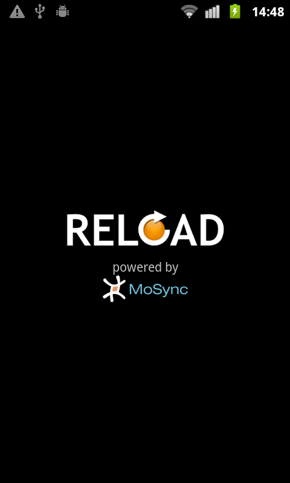
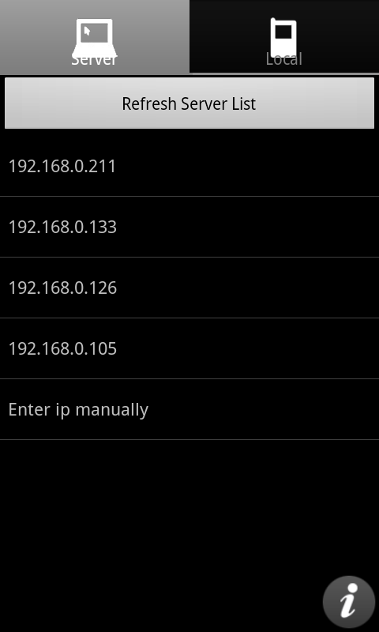
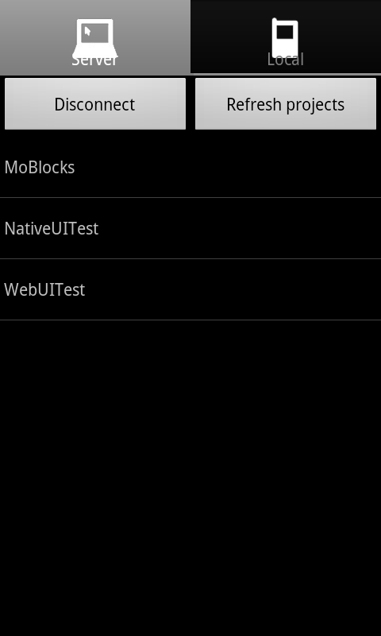
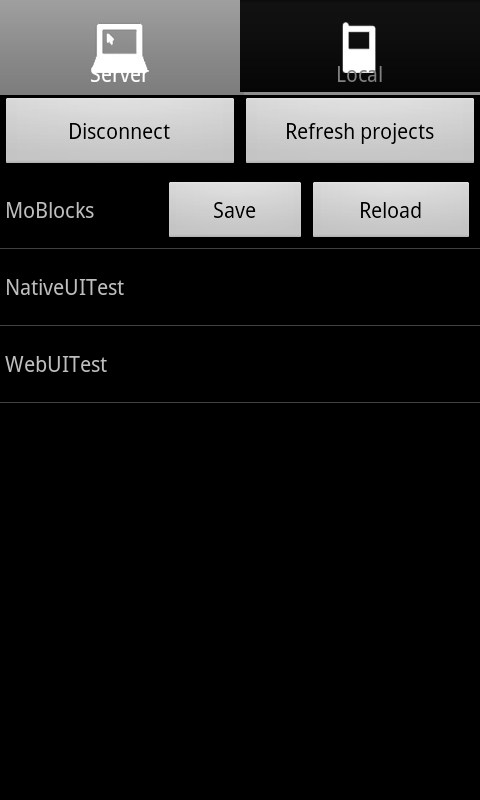
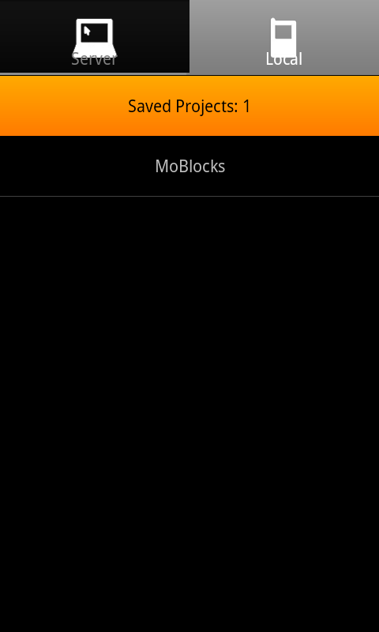

<!-- <mosyncheadertags>
<meta name="description" content="MoSync Reload Client App" />
<meta name="keywords" content="mobile development,dev,sdk,ide,apps,mobile,apps,android,ios,iphone,ipad,mobile,open source,application,ide,cross
platform,programming,mosync,,reload,mosync reload,native ui,nativeui" />
<title>Reload Client App</title>
</mosyncheadertags> -->

**Please note that it is important to use the same version of the Reload Client app and the Reload Server. If you install a new version of the Reload Server package, make sure you also install the new version of the client.**

# Reload Client App

Reload Client is an app that you install on your device to connect to the Reload Server and the Development UI. The client app works as a container, it downloads your project and runs it on the device. 

The Reload Client app can be downloaded from the app stores (iOS, Android, Windows Phone), for easy installation on your devices. It is also included in the [MoSync Reload download](http://www.mosync.com/download/reload).

It should be noted that the app is written using the MoSync SDK, with the full source code available. This means that you can build the Reload Client yourself, and modify the code to suite your needs. Be aware of the version of the client code you use, it must match the Reload Server/Development UI. You can get the Reload Client source code from GitHub: [OneOne](https://github.com/MoSync/Reload/tree/OneOne/ReloadClient) branch, [master](https://github.com/MoSync/Reload/tree/master/ReloadClient) branch.

# A Tour of the Reload Client UI

## Startup screen

{: .screenshot} 

## Server connect screen

When launching the Reload Client app, the app automatically scans the local network for any running Reload servers, and presents a list of them. Connect to a server by selecting it from the list. You can also enter an IP-address manually if the automatic server discovery should not work (this is needed on Windows Phone).

{: .screenshot} 

## Server projects screen

When connected to a server, you are presented with a list of projects present in the current server workspace (change this workspace in the Server Development UI). Select the Refresh button to update the project list.

{: .screenshot} 

You can save projects locally, or reload a project from the server, by choosing a project in the list and selecting one of the contexual buttons presented:

{: .screenshot} 

## Local projects screen

This screen displays a list of projects save on the device. Select an app from the list to load it. This works also when you a not connected to the network.

{: .screenshot} 

(Currently there is no support for deleting projects, go to the system settings of the device and remove local files for the ReloadClient application.) 

# Hints

On Android, it works to exit a reloaded app by calling mosync.app.exit(); in your JavaScript code:

    // Close the application when the back key is pressed.
    document.addEventListener(
        "backbutton",
        function() { mosync.app.exit(); },
        true);
        
This will take you back to the Reload Client UI when the device back button is pressed. 

On iOS you will have to manually quit the app and restart it to get back to the Client UI.

However, note that you can always reload apps from the Reload Development UI, and from there you can also disconnect clients. When a client is disconnected, the Reload CLient UI is displayed automatically. 
