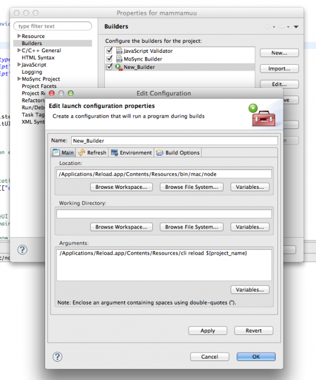

<!-- <mosyncheadertags>
<meta name="description" content="MoSync Reload Command Line Tool - Invoke Reload from the command line, run Reload from your favourite editor." />
<meta name="dcterms.description" content="MoSync Reload Command Line Tool - Invoke Reload from the command line, run Reload from your favourite editor." />
<meta name="keywords" content="app development,mobile development,javascript,rapid development" />
<title>MoSync Reload - Reload Command Line Tool</title>
</mosyncheadertags> -->

Reload Command Line Tool
========================

By Igor Eklund

Invoke Reload from the command line
-----------------------------------

I'm thrilled to announce that it's now possible to invoke Reload functionality from command line! One implication of this is that automation of some repetitive tasks associated with Reload becomes an option. Below I'm going to show how to create and reload a project from command line and a couple examples of how this feature could be used to automate reloading of a project from a your favourite code editor.

The basics
----------

First you have to launch Reload application and connect at least one device to the Reload. When you've done that, point your command line terminal to the Reload installation directory where the Reload command line script is located. On OS X it's typically `/Applications/Reload.app/Contents/Resources/` and on windows it's in `MoSync_Reload_Windows\server\` From there run following commands.

### On OSX and Linux

Confirm that you have client's connected:

    $ ./cli clients

Output should then look something like this:

    Name      Address          Platform    Version
    --------------------------------------------------
    maguro    192.168.0.132    Android     4.1.1

Create a new project:

    $ ./cli create My_Awesome_Project

Reload the project you just created:

    $ ./cli reload My_Awesome_Project

You can replace `My_Awesome_Project` with your own awesome name. By default the project will be created in your current Reload workspace directory. If your would like to change workspace to something else, following command can be used:

    $ ./cli workspace -p /path/to/your/workspace

To see what projects are in current workspce run:

    $ ./cli projects

For all other available options:

    $ ./cli [command] --help

### On Windows

On a windows machine you can run command line tool by pointing your terminal to `MoSync_Reload_Windows\server\` catalogue and run

    > bin\win\node.exe cli --help

That is, you have to prepend the script name with a reference to a working nodejs instance. In this example an instance bundled with MoSync Reload is used.

IDE integration
---------------

Now that we have some basics down let's put it to some use!

### MoSync IDE integration

Following will make MoSync IDE call a reload command each time specified project is built.

-   Right click on a project. Go to `Properties > Builders > New`
-   In "Location" field, enter path to a working nodejs instance.
-   In "Arguments" field put path to the `cli` file and a command you would like to run.

My setup on OS X looks like this: 

### Vim intergration

You can invoke reload directly form Vim by typing

    :!./path/to/cli

Where `path/to` should be path to where the `cli` script is located.

Or you can reload a specific project each time a file buffer is saved:

    :autocmd BufWritePost * !./path/to/cli reload MyProject

Final words
-----------

I hope you found this guide useful. And if you have any suggestions for improvements feel free to leave a comment! I can be reached at igor at mosync.com.
